# MedArchive RAG

**Production-Ready Clinical Decision Support System**

> *Sub-second medical AI that provides physicians with evidence-based answers sourced directly from verified institutional guidelines with real-time conversational follow-up.*

[](https://www.python.org/downloads/)
[](https://fastapi.tiangolo.com/)
[](https://developer.mozilla.org/en-US/docs/Web/API/WebSocket)


---

## ✨ Live Features

✅ **Real-time conversation**  - WebSocket streaming with typing indicators
✅ **Session management**     - Persistent conversation history across refreshes
✅ **Medical knowledge base** - 7 indexed documents with 500+ medical chunks
✅ **Sub-second retrieval**   - 200-400ms response times via Groq + Qdrant
✅ **Citation tracking**      - Source documents with page references
✅ **Gray UI theme**          - Professional medical interface
✅ **New Chat functionality** - Session reset with preserved context

---

## 🏗️ System Architecture

```mermaid
graph TB
    User[👨‍⚕️ Clinician] --> WebUI[🖥️ Web Interface]
    WebUI --> WS[WebSocket Connection]
    WS --> API[FastAPI Service]

    API --> SM[Session Manager]
    API --> RET[Retrieval Engine]
    API --> LLM[Groq LLM Service]
    API --> CIT[Citation Extractor]

    SM --> CONV[(Conversation Store)]
    RET --> VDB[(Qdrant Vector DB)]

    PDF[📄 Medical PDFs] --> PARSE[LlamaParse]
    PARSE --> CHUNK[Semantic Chunker]
    CHUNK --> EMB[BGE Embeddings]
    EMB --> VDB

    style User fill:#e1f5fe
    style API fill:#f1f8e9
    style VDB fill:#fce4ec
    style LLM fill:#fff3e0
```



### Two-Stage Retrieval Pipeline

1. **Wide Net** (Recall): BGE-Large embeddings → Qdrant search → Top 50 chunks
2. **Filter** (Precision): BGE-Reranker-v2-m3 → Cross-encoder ranking → Top 5 chunks
3. **Generate**: Groq Llama-3.3-70B → Streaming response → Citation extraction

---

## 🚀 Quick Start

### Prerequisites

- **Python 3.11+**
- **Git**
- **API Keys**:
  - [Groq API Key](https://console.groq.com/) (for LLM inference)
  - [LlamaParse API Key](https://llamaparse.com/) (for PDF parsing)

### 1-Minute Setup

```powershell
# 1. Clone and setup
git clone <repository-url>
cd MedArchive-Rag
python -m venv .venv
.venv\Scripts\Activate.ps1

# 2. Install dependencies
pip install -r requirements.txt

# 3. Configure environment
cp .env.example .env
# Edit .env - add your GROQ_API_KEY and LLAMAPARSE_API_KEY

# 4. Download medical documents (optional - 5 real PDFs)
python scripts/create_sample_pdfs.py

# 5. Index documents
python -m services.ingestion.src.main

# 6. Start API server
python -m uvicorn services.api.src.main:app --host 127.0.0.1 --port 8001

# 7. Open browser
start http://127.0.0.1:8001
```

**That's it!** You now have a medical AI running locally with conversation history.

---

## 📂 Project Structure

### Core Services

```
services/
├── api/                        # FastAPI REST + WebSocket API
│   └── src/
│       ├── main.py            # Application entrypoint
│       ├── routes/            # API route handlers
│       ├── llm/               # Groq LLM integration
│       ├── retrieval/         # Qdrant vector search
│       ├── conversation/      # Session management
│       ├── citations/         # Source attribution
│       └── observability/     # Phoenix tracing
│
└── ingestion/                 # Background document processing
    └── src/
        ├── main.py           # Ingestion pipeline entrypoint
        ├── parsers/          # LlamaParse PDF processing
        ├── chunking/         # Semantic text chunking
        ├── embedding/        # BGE embeddings generation
        ├── indexing/         # Qdrant index management
        └── sync/             # File change detection
```

### Supporting Infrastructure

```
shared/                        # Cross-service utilities
├── models/                    # Pydantic data models
├── utils/                     # Configuration & logging
└── constants/                 # Shared constants

static/                        # Frontend web interface
├── index.html                # Main chat interface
└── assets/                   # CSS, JS, images

data/                         # Application data
├── document_store/           # Source PDF files
├── vector_storage/           # Qdrant persistent data
└── logs/                     # Application logs

docs/                         # Documentation
├── ARCHITECTURE.md           # System design details
├── DEVELOPMENT.md            # Developer setup guide
└── modules/                  # Module-specific docs
```

---

## 🛠️ Core Modules

### 🔍 Retrieval Engine (`services/api/src/retrieval/`)

**Purpose**: Semantic search and document retrieval

**Key Components**:
- `Retriever`: Qdrant vector similarity search
- `Reranker`: BGE cross-encoder for precision ranking
- `EmbeddingService`: BGE-Large text vectorization

**Usage**:
```python
retriever = Retriever(qdrant_url="http://localhost:6333")
results = await retriever.search("diabetes treatment", top_k=50)
reranked = await reranker.rerank(query, results, top_k=5)
```

### 🧠 LLM Service (`services/api/src/llm/`)

**Purpose**: Groq API integration for answer generation

**Key Features**:
- Streaming token generation (280 tok/sec)
- Conversation history management
- Context-aware prompting
- Temperature control for medical accuracy

**Usage**:
```python
llm = LLMService(api_key=groq_key)
async for chunk in llm.generate_answer_stream(query, context_chunks):
    yield chunk  # Real-time streaming
```

### 💬 Conversation Manager (`services/api/src/conversation/`)

**Purpose**: Multi-turn dialogue and session persistence

**Key Features**:
- UUID-based session tracking
- In-memory conversation storage
- Context window management (5 turns)
- Automatic session cleanup

**Usage**:
```python
session_manager = SessionManager()
session = session_manager.get_or_create_session(session_id)
session.add_message("user", "What is diabetes?")
context = session.get_context(max_turns=5)
```

### 📄 Document Ingestion (`services/ingestion/src/`)

**Purpose**: PDF parsing and vector indexing pipeline

**Key Components**:
- `LlamaParseClient`: Table-aware PDF parsing
- `SemanticChunker`: Intelligent text segmentation
- `QdrantIndexer`: Vector database population
- `FileSync`: Incremental document updates

**Processing Flow**:
1. **Parse**: LlamaParse extracts structured text + tables
2. **Chunk**: Semantic chunker creates 400-token segments
3. **Embed**: BGE-Large generates 1024-dim vectors
4. **Index**: Qdrant stores with metadata preservation

### 🔗 Citation Extraction (`services/api/src/citations/`)

**Purpose**: Source attribution and reference tracking

**Key Features**:
- Fuzzy text matching across chunks
- Page number preservation
- Relevance scoring
- Citation deduplication

---

## 🌐 Web Interface

### Real-time Chat Features

- **WebSocket Streaming**: Character-by-character response display
- **Session Persistence**: Conversations survive page refreshes via localStorage
- **Typing Indicators**: "🔍 Searching documents...", "✍️ Writing response..."
- **Citation Display**: Clickable source references with page numbers
- **Suggested Questions**: Context-aware follow-up prompts
- **New Chat**: Clean session reset while preserving connection

### Visual Design

- **Gray Medical Theme**: Professional clinical interface
- **Responsive Layout**: Desktop and mobile optimized
- **Markdown Rendering**: Rich text with code highlighting
- **Loading States**: Smooth transitions and progress indicators

---


## 📊 Configuration


### Model Configuration

```python
# LLM Settings
GROQ_MODEL = "llama-3.3-70b-versatile"  # 280 tokens/sec
TEMPERATURE = 0.1                        # Low for medical accuracy
MAX_TOKENS = 2048                        # Comprehensive answers

# Retrieval Settings
TOP_K_INITIAL = 50                       # Wide recall
TOP_K_RERANKED = 5                       # High precision
SCORE_THRESHOLD = 0.3                    # Relevance cutoff

# Chunking Settings
CHUNK_SIZE = 400                         # Token limit per chunk
CHUNK_OVERLAP = 50                       # Context preservation
```

---


## 🔗 API Reference

### WebSocket Endpoints

**`/api/v1/chat/ws`** - Real-time conversational interface

**Message Format**:
```json
{
  "message": "What is the treatment for diabetes?",
  "session_id": "uuid-string",
  "enable_reranking": true,
  "max_context_turns": 5
}
```

**Response Events**:
- `session`: Session ID assignment
- `typing`: Progress indicators
- `token`: Streaming text chunks
- `complete`: Final response with citations
- `error`: Error messages

### REST Endpoints

**`POST /api/v1/chat`** - Non-streaming conversation

**`GET /health`** - Service health status

**`GET /api/v1/stats`** - System performance metrics

**`DELETE /api/v1/chat/{session_id}`** - Clear conversation history

---


## 🚀 Development Workflow

### Local Development

```powershell
# Activate virtual environment
.venv\Scripts\Activate.ps1

# Install dependencies
pip install -r requirements.txt

# Run in development mode (hot reload)
uvicorn services.api.src.main:app --reload --host 127.0.0.1 --port 8001

# Run ingestion pipeline
python -m services.ingestion.src.main

# Access development interface
start http://127.0.0.1:8001
```

### Code Quality

```powershell
# Formatting
black services/ shared/ --line-length 100
isort services/ shared/

# Linting
flake8 services/ shared/ --max-line-length=100
mypy services/ shared/ --ignore-missing-imports

# Testing
pytest tests/ -v --cov=services --cov=shared
```

---

## 🎯 Technology Stack

### Core Infrastructure

| Component | Technology | Purpose |
|-----------|-----------|---------|
| **API Framework** | FastAPI + Uvicorn | High-performance async REST + WebSocket |
| **Vector Database** | Qdrant | Sub-millisecond semantic search |
| **LLM Service** | Groq + Llama-3.3-70B | Ultra-fast generation (280 tok/sec) |
| **PDF Processing** | LlamaParse | Table-aware medical document parsing |
| **Embeddings** | BGE-Large-EN-v1.5 | State-of-the-art 1024-dim vectors |
| **Reranking** | BGE-Reranker-v2-M3 | Cross-encoder precision ranking |

### Development Tools

| Component | Technology | Purpose |
|-----------|-----------|---------|
| **Environment** | Python 3.11 + venv | Isolated dependency management |
| **Dependency Management** | pip + requirements.txt | Simplified package installation |
| **Configuration** | Pydantic Settings | Type-safe environment configuration |
| **Logging** | Structured JSON | Production-ready observability |
| **Testing** | pytest | Comprehensive test coverage |
| **Code Quality** | black + flake8 + mypy | Consistent formatting and type safety |

### Observability

| Component | Technology | Purpose |
|-----------|-----------|---------|
| **Tracing** | Phoenix (optional) | Query performance analysis |
| **Monitoring** | Health endpoints | Automated uptime checking |
| **Logging** | JSON structured logs | Production debugging |
| **Metrics** | Built-in stats API | Performance monitoring |

---

## 📚 Additional Resources

### Documentation

- **[🏛️ Architecture Guide](docs/ARCHITECTURE.md)** - System design patterns and data flow
- **[⚙️ Development Guide](docs/DEVELOPMENT.md)** - Setup workflows and coding standards
- **[📚 Module Documentation](docs/modules/)** - Detailed component references

### External Resources

- **[Groq API Documentation](https://console.groq.com/docs)** - LLM service integration
- **[Qdrant Documentation](https://qdrant.tech/documentation/)** - Vector database operations
- **[LlamaParse Documentation](https://docs.llamaindex.ai/en/stable/llama_cloud/llama_parse/)** - PDF parsing service
- **[BGE Models](https://huggingface.co/BAAI)** - Embedding and reranking models
- **[Phoenix Tracing](https://docs.arize.com/phoenix)** - AI observability platform

