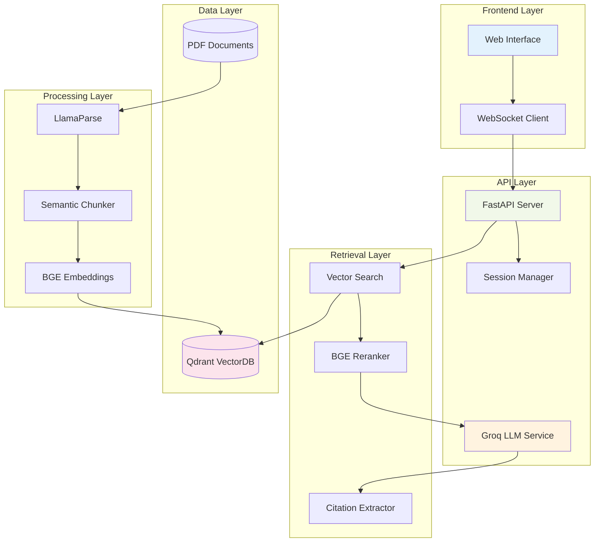
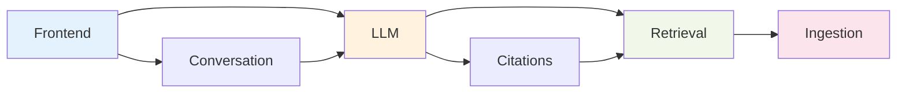

# MedArchive RAG Module Documentation

**Comprehensive technical documentation for all system components**

This directory contains detailed documentation for each module of the MedArchive RAG system. Each guide includes architecture diagrams, code examples, configuration options, and usage patterns.

---

## 📚 Module Index

### 🔍 [Retrieval Module](retrieval.md)
**Purpose**: High-performance semantic search and document retrieval
**Key Features**: Qdrant vector search, BGE embeddings, two-stage retrieval with reranking
**Performance**: ~50ms end-to-end, 200+ QPS throughput

### 🧠 [LLM Module](llm.md)
**Purpose**: Groq API integration for ultra-fast medical question answering
**Key Features**: Streaming responses, conversation context, 280 tokens/sec generation
**Model**: Llama-3.3-70B with medical-optimized prompting

### 💬 [Conversation Module](conversation.md)
**Purpose**: Multi-turn dialogue management with persistent sessions
**Key Features**: Session persistence, context tracking, follow-up understanding
**Storage**: In-memory (dev) / Redis (production)

### 📄 [Ingestion Module](ingestion.md)
**Purpose**: Background PDF processing pipeline with table-aware parsing
**Key Features**: LlamaParse integration, semantic chunking, incremental sync
**Processing**: 400-token chunks with BGE-Large embeddings

### 🔗 [Citations Module](citations.md)
**Purpose**: Source attribution and reference tracking for verifiable answers
**Key Features**: Fuzzy text matching, relevance scoring, citation formatting
**Quality**: Precision metrics and deduplication

### 🌐 [Frontend Module](frontend.md)
**Purpose**: Real-time web interface with WebSocket streaming
**Key Features**: Session persistence, typing indicators, mobile responsive
**Theme**: Professional gray medical interface

---

## 🏗️ System Architecture

## 🚀 Quick Module Navigation

### For Backend Developers
- **API Development**: [LLM Module](llm.md) → [Conversation Module](conversation.md)
- **Search Engineering**: [Retrieval Module](retrieval.md) → [Citations Module](citations.md)
- **Data Pipeline**: [Ingestion Module](ingestion.md)

### For Frontend Developers
- **UI Development**: [Frontend Module](frontend.md)
- **WebSocket Integration**: [Frontend Module](frontend.md) → [LLM Module](llm.md)
- **Session Management**: [Frontend Module](frontend.md) → [Conversation Module](conversation.md)

### For DevOps/Infrastructure
- **Vector Database**: [Retrieval Module](retrieval.md) → [Ingestion Module](ingestion.md)
- **API Scaling**: [LLM Module](llm.md) → [Conversation Module](conversation.md)
- **Document Processing**: [Ingestion Module](ingestion.md)

### For Medical Domain Experts
- **Citation Accuracy**: [Citations Module](citations.md)
- **Content Processing**: [Ingestion Module](ingestion.md)
- **Answer Quality**: [LLM Module](llm.md)

---

## 📋 Module Dependencies

## 🔧 Configuration Matrix

| Module | Config File | Environment Variables | Dependencies |
|--------|-------------|----------------------|-------------|
| **Retrieval** | `shared/utils.py` | `QDRANT_URL`, `EMBEDDING_MODEL` | Qdrant, BGE models |
| **LLM** | `shared/utils.py` | `GROQ_API_KEY`, `GROQ_MODEL` | Groq API |
| **Conversation** | `shared/utils.py` | Session storage settings | Redis (prod) |
| **Ingestion** | `shared/utils.py` | `LLAMAPARSE_API_KEY` | LlamaParse, Qdrant |
| **Citations** | Built-in settings | - | Retrieval results |
| **Frontend** | `static/index.html` | WebSocket URL | API server |

## 🧪 Testing Strategy

### Unit Tests by Module
- **Retrieval**: Vector search accuracy, embedding generation
- **LLM**: Response quality, streaming functionality
- **Conversation**: Session persistence, context management
- **Ingestion**: PDF parsing, chunking algorithms
- **Citations**: Text matching accuracy, relevance scoring
- **Frontend**: UI interactions, WebSocket handling

### Integration Tests
- **End-to-end**: User query → Vector search → LLM generation → Citation extraction
- **Performance**: Latency benchmarks across module boundaries
- **Reliability**: Error handling and recovery scenarios

## 📈 Performance Characteristics

| Module | Latency | Throughput | Memory Usage | Scalability |
|--------|---------|------------|--------------|-------------|
| **Retrieval** | ~50ms | 200+ QPS | ~1GB | Horizontal |
| **LLM** | ~100ms | 50+ QPS | ~2GB | API-limited |
| **Conversation** | <5ms | 1000+ QPS | ~100MB | Memory-bound |
| **Ingestion** | ~30s/doc | 1 doc/min | ~3GB | CPU-bound |
| **Citations** | ~20ms | 500+ QPS | ~50MB | CPU-bound |
| **Frontend** | <10ms | 1000+ users | ~10MB | WebSocket-limited |

---

## 🔗 External Resources

### API Documentation
- **[Groq API Docs](https://console.groq.com/docs)** - LLM service integration
- **[Qdrant API Docs](https://qdrant.tech/documentation/)** - Vector database operations
- **[LlamaParse Docs](https://docs.llamaindex.ai/en/stable/llama_cloud/llama_parse/)** - PDF parsing service

### Model Documentation
- **[BGE Models](https://huggingface.co/BAAI)** - Embedding and reranking models
- **[Llama-3.3-70B](https://huggingface.co/meta-llama)** - Language model specifications

### Infrastructure Guides
- **[Docker Compose Setup](../DEVELOPMENT.md)** - Local development environment
- **[Production Deployment](../ARCHITECTURE.md)** - Scaling and monitoring

---

## 💡 Contributing to Documentation

### Adding New Modules
1. Create new `.md` file in `docs/modules/`
2. Follow the template structure from existing modules
3. Update this index file with new module entry
4. Add cross-references from related modules

### Documentation Standards
- **Structure**: Purpose → Architecture → Components → Examples → Configuration
- **Code Samples**: Include working, copy-pasteable examples
- **Diagrams**: Use Mermaid for architecture and flow diagrams
- **Cross-linking**: Reference related modules and external docs

### Review Process
- Technical accuracy review by module maintainer
- Documentation clarity review by technical writer
- User testing with target audience (dev/ops/medical)

---

**🏥 Building better medical AI, one module at a time.**
