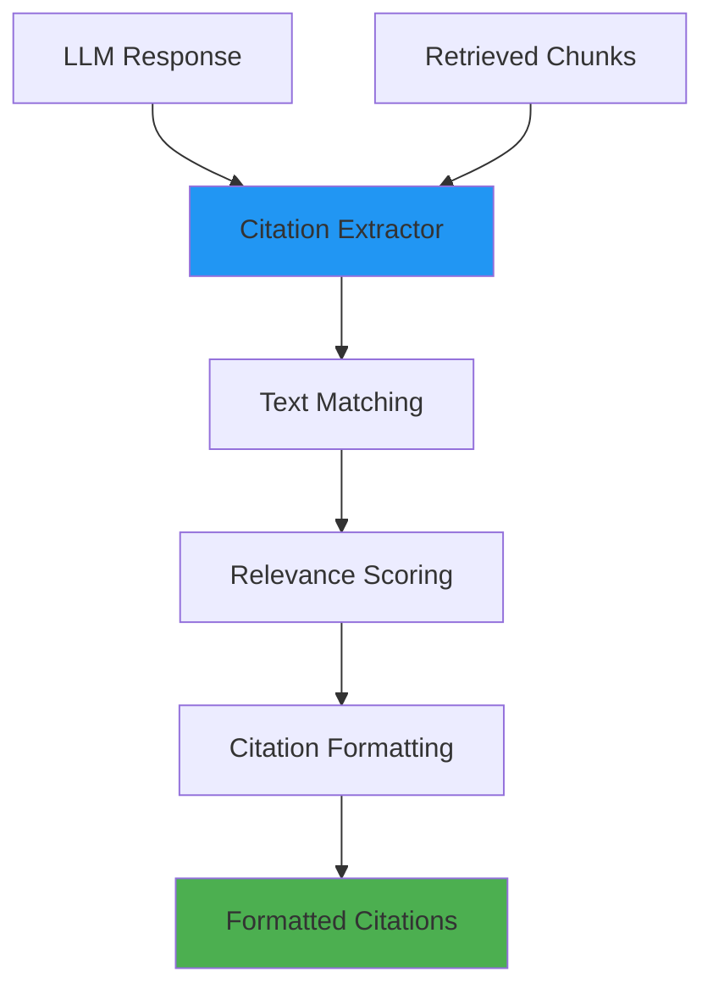

# Citations Module

**Location**: `services/api/src/citations/`

**Purpose**: Extract and format source citations from LLM responses, providing verifiable references to medical documents.

---

## Architecture



## Core Components

### CitationExtractor Class

**File**: `__init__.py`

**Purpose**: Primary interface for citation extraction and formatting

#### Key Methods
```python
class CitationExtractor:
    def extract_citations(
        answer: str,
        search_results: List[SearchResult]
    ) -> List[Citation]:
        """Extract citations from LLM answer using fuzzy matching"""

    def _find_answer_sources(
        answer: str,
        chunks: List[SearchResult]
    ) -> List[SourceMatch]:
        """Find which chunks contributed to the answer"""

    def _format_citation(
        chunk: SearchResult,
        relevance_score: float
    ) -> Citation:
        """Format chunk into citation object"""
```

### Citation Data Model

**Purpose**: Structured representation of source references

```python
class Citation(BaseModel):
    document_id: UUID               # Source document identifier
    document_title: str            # Human-readable document name
    page_numbers: List[int]        # Page references
    text_snippet: str              # Relevant excerpt (max 200 chars)
    relevance_score: float         # Matching confidence (0.0-1.0)
    section_path: Optional[str]    # Document section hierarchy
    source_file: str               # Original filename
```

### Example Citations

```json
[
    {
        "document_id": "550e8400-e29b-41d4-a716-446655440000",
        "document_title": "Diabetes Management Guidelines",
        "page_numbers": [42, 43],
        "text_snippet": "First-line treatment for type 2 diabetes is metformin 500mg twice daily, titrated based on glycemic control...",
        "relevance_score": 0.89,
        "section_path": "Chapter 3 > Pharmacological Treatment",
        "source_file": "diabetes_guidelines_2026.pdf"
    },
    {
        "document_id": "6ba7b810-9dad-11d1-80b4-00c04fd430c8",
        "document_title": "Cardiovascular Prevention Guidelines",
        "page_numbers": [15],
        "text_snippet": "Patients with diabetes have 2-4x higher cardiovascular risk requiring aggressive lipid management...",
        "relevance_score": 0.76,
        "section_path": "Section 2 > Risk Stratification",
        "source_file": "cvd_prevention_2026.pdf"
    }
]
```

## Text Matching Algorithm

### Fuzzy Matching Strategy

```python
def _find_answer_sources(
    self,
    answer: str,
    chunks: List[SearchResult]
) -> List[SourceMatch]:
    """Find chunks that contributed to answer using fuzzy text matching"""

    matches = []
    answer_sentences = self._split_into_sentences(answer)

    for chunk in chunks:
        chunk_sentences = self._split_into_sentences(chunk.text)

        # Find sentence-level matches
        for answer_sent in answer_sentences:
            for chunk_sent in chunk_sentences:
                similarity = self._calculate_similarity(
                    answer_sent, chunk_sent
                )

                if similarity > 0.4:  # Threshold for relevance
                    matches.append(SourceMatch(
                        chunk=chunk,
                        answer_text=answer_sent,
                        source_text=chunk_sent,
                        similarity=similarity
                    ))

    # Deduplicate and rank by similarity
    return self._deduplicate_matches(matches)
```

### Similarity Calculation

```python
from difflib import SequenceMatcher
from sentence_transformers import SentenceTransformer

class SimilarityCalculator:
    def __init__(self):
        # Use lightweight model for fast similarity
        self.model = SentenceTransformer('all-MiniLM-L6-v2')

    def _calculate_similarity(self, text1: str, text2: str) -> float:
        """Calculate semantic similarity between text snippets"""

        # Method 1: Character-level similarity (fast)
        char_similarity = SequenceMatcher(None, text1, text2).ratio()

        # Method 2: Semantic embedding similarity (accurate)
        if len(text1) > 20 and len(text2) > 20:  # Only for substantial text
            embeddings = self.model.encode([text1, text2])
            semantic_similarity = cosine_similarity([embeddings[0]], [embeddings[1]])[0][0]
        else:
            semantic_similarity = char_similarity

        # Weighted combination
        final_score = 0.3 * char_similarity + 0.7 * semantic_similarity
        return final_score
```

### Sentence Segmentation

```python
import re
from typing import List

def _split_into_sentences(self, text: str) -> List[str]:
    """Split text into sentences, handling medical abbreviations"""

    # Medical abbreviations to preserve
    abbreviations = {
        'Dr.', 'Prof.', 'vs.', 'etc.', 'i.e.', 'e.g.',
        'mg.', 'ml.', 'kg.', 'cm.', 'mm.',  # Units
        'b.i.d.', 't.i.d.', 'q.i.d.', 'p.r.n.'  # Medical dosing
    }

    # Protect abbreviations
    protected_text = text
    for abbrev in abbreviations:
        protected_text = protected_text.replace(abbrev, abbrev.replace('.', '<DOT>'))

    # Split on sentence boundaries
    sentences = re.split(r'[.!?]+\s+', protected_text)

    # Restore abbreviations
    sentences = [
        sent.replace('<DOT>', '.').strip()
        for sent in sentences
        if len(sent.strip()) > 5  # Filter very short fragments
    ]

    return sentences
```

## Citation Formatting

### Standard Medical Citation

```python
def _format_citation(
    self,
    chunk: SearchResult,
    relevance_score: float
) -> Citation:
    """Format search result into standard citation"""

    # Extract document title from filename or metadata
    document_title = self._extract_document_title(chunk.source_file)

    # Create concise text snippet
    text_snippet = self._create_snippet(
        chunk.text,
        max_length=200,
        preserve_context=True
    )

    return Citation(
        document_id=chunk.document_id,
        document_title=document_title,
        page_numbers=chunk.page_numbers or [],
        text_snippet=text_snippet,
        relevance_score=relevance_score,
        section_path=chunk.section_path,
        source_file=chunk.source_file
    )

def _extract_document_title(self, filename: str) -> str:
    """Convert filename to readable document title"""

    # Remove extension and path
    base_name = os.path.splitext(os.path.basename(filename))[0]

    # Title case with space normalization
    title = base_name.replace('_', ' ').replace('-', ' ')
    title = ' '.join(word.capitalize() for word in title.split())

    # Handle common patterns
    replacements = {
        'Cvd': 'CVD',
        'Guidelines': 'Guidelines',
        'Pdf': '',  # Remove redundant "PDF"
        '2026': '(2026)'
    }

    for old, new in replacements.items():
        title = title.replace(old, new)

    return title.strip()
```

### Snippet Creation

```python
def _create_snippet(
    self,
    text: str,
    max_length: int = 200,
    preserve_context: bool = True
) -> str:
    """Create informative text snippet for citation"""

    if len(text) <= max_length:
        return text

    if preserve_context:
        # Find complete sentences within length limit
        sentences = self._split_into_sentences(text)
        snippet = ""

        for sentence in sentences:
            if len(snippet + sentence) <= max_length - 3:  # Reserve space for "..."
                snippet += sentence + " "
            else:
                break

        if snippet and len(snippet) < len(text):
            snippet = snippet.strip() + "..."

        return snippet or text[:max_length-3] + "..."
    else:
        # Simple truncation
        return text[:max_length-3] + "..."
```

## Deduplication

### Source Consolidation

```python
def _deduplicate_matches(self, matches: List[SourceMatch]) -> List[SourceMatch]:
    """Remove duplicate citations and consolidate similar sources"""

    # Group by document and page
    grouped = defaultdict(list)
    for match in matches:
        key = (match.chunk.document_id, tuple(match.chunk.page_numbers or []))
        grouped[key].append(match)

    # Keep highest scoring match from each group
    deduplicated = []
    for group in grouped.values():
        # Sort by similarity score and take best
        best_match = max(group, key=lambda m: m.similarity)

        # Only include if similarity is above threshold
        if best_match.similarity > 0.5:
            deduplicated.append(best_match)

    # Sort final results by relevance score (descending)
    return sorted(deduplicated, key=lambda m: m.similarity, reverse=True)
```

### Page Range Consolidation

```python
def _consolidate_page_ranges(self, page_numbers: List[int]) -> str:
    """Convert list of pages to readable ranges"""

    if not page_numbers:
        return ""

    sorted_pages = sorted(set(page_numbers))
    ranges = []
    start = sorted_pages[0]
    end = start

    for page in sorted_pages[1:]:
        if page == end + 1:
            end = page  # Extend current range
        else:
            # Add completed range
            if start == end:
                ranges.append(str(start))
            else:
                ranges.append(f"{start}-{end}")
            start = end = page

    # Add final range
    if start == end:
        ranges.append(str(start))
    else:
        ranges.append(f"{start}-{end}")

    return ", ".join(ranges)

# Example: [15, 16, 17, 19, 21, 22] -> "15-17, 19, 21-22"
```

## Web Interface Integration

### Citation Display

```javascript
// Frontend citation rendering
function renderCitations(citations) {
    const citationsDiv = document.querySelector('.citations');

    if (citations.length === 0) {
        citationsDiv.style.display = 'none';
        return;
    }

    citationsDiv.innerHTML = `
        <strong>Sources:</strong>
        ${citations.map((citation, index) => `
            <div class="citation" data-relevance="${citation.relevance_score}">
                <strong>[${index + 1}]</strong>
                ${citation.document_title}
                ${citation.page_numbers.length > 0 ? `(p. ${citation.page_numbers.join(', ')})` : ''}
                <div class="citation-snippet">
                    "${citation.text_snippet}"
                </div>
            </div>
        `).join('')}
    `;

    citationsDiv.style.display = 'block';
}
```

### Citation CSS Styling

```css
.citations {
    margin-top: 12px;
    padding-top: 12px;
    border-top: 2px solid rgba(102,126,234,0.2);
    font-size: 13px;
}

.citation {
    display: inline-block;
    margin: 4px 8px 4px 0;
    padding: 6px 12px;
    background: rgba(102,126,234,0.15);
    border: 1px solid rgba(102,126,234,0.3);
    border-radius: 4px;
    cursor: pointer;
    transition: background-color 0.2s;
}

.citation:hover {
    background: rgba(102,126,234,0.25);
}

.citation-snippet {
    font-style: italic;
    color: #666;
    margin-top: 4px;
    font-size: 11px;
}
```

## Quality Metrics

### Citation Accuracy

```python
class CitationQualityMetrics:
    def calculate_metrics(self, citations: List[Citation]) -> Dict[str, float]:
        """Calculate citation quality metrics"""

        if not citations:
            return {"precision": 0.0, "coverage": 0.0, "diversity": 0.0}

        # Precision: Average relevance score
        precision = sum(c.relevance_score for c in citations) / len(citations)

        # Coverage: Number of unique documents cited
        unique_docs = len(set(c.document_id for c in citations))
        coverage = unique_docs / min(len(citations), 5)  # Max expected citations

        # Diversity: Page spread within documents
        page_diversity = self._calculate_page_diversity(citations)

        return {
            "precision": precision,
            "coverage": coverage,
            "diversity": page_diversity
        }

    def _calculate_page_diversity(self, citations: List[Citation]) -> float:
        """Calculate how well citations span document pages"""

        doc_pages = defaultdict(set)
        for citation in citations:
            doc_pages[citation.document_id].update(citation.page_numbers)

        if not doc_pages:
            return 0.0

        # Average page span per document
        spans = [
            max(pages) - min(pages) + 1 if pages else 0
            for pages in doc_pages.values()
        ]

        avg_span = sum(spans) / len(spans)
        return min(avg_span / 10, 1.0)  # Normalize to 0-1
```

### Logging and Monitoring

```python
def extract_citations_with_logging(
    self,
    answer: str,
    search_results: List[SearchResult]
) -> List[Citation]:
    """Extract citations with quality logging"""

    start_time = time.time()

    try:
        citations = self.extract_citations(answer, search_results)

        # Calculate quality metrics
        metrics = CitationQualityMetrics().calculate_metrics(citations)

        # Log extraction results
        logger.info("Citations extracted", extra={
            "citation_count": len(citations),
            "source_chunk_count": len(search_results),
            "extraction_time_ms": (time.time() - start_time) * 1000,
            "avg_relevance_score": metrics["precision"],
            "unique_documents": len(set(c.document_id for c in citations)),
            "total_pages_cited": sum(len(c.page_numbers) for c in citations)
        })

        return citations

    except Exception as e:
        logger.error(f"Citation extraction failed: {e}", extra={
            "answer_length": len(answer),
            "search_results_count": len(search_results)
        })
        return []
```

## Usage Examples

### Basic Citation Extraction

```python
from services.api.src.citations import CitationExtractor

# Initialize extractor
extractor = CitationExtractor()

# Extract citations from LLM response
answer = "Type 2 diabetes treatment begins with metformin 500mg twice daily..."
search_results = [...]  # Retrieved chunks from Qdrant

citations = extractor.extract_citations(answer, search_results)

# Display citations
for i, citation in enumerate(citations, 1):
    print(f"[{i}] {citation.document_title}")
    if citation.page_numbers:
        print(f"    Pages: {', '.join(map(str, citation.page_numbers))}")
    print(f"    Relevance: {citation.relevance_score:.2f}")
    print(f"    Snippet: \"{citation.text_snippet}\"")
    print()
```

### Integration with API Response

```python
@app.post("/api/v1/query")
async def query_endpoint(request: QueryRequest) -> QueryResponse:
    # ... retrieval and LLM generation ...

    # Extract citations
    citations = citation_extractor.extract_citations(
        answer=generated_answer,
        search_results=search_results
    )

    return QueryResponse(
        query=request.query,
        answer=generated_answer,
        citations=citations,  # Include in API response
        retrieved_chunks=convert_to_retrieval_results(search_results),
        latency_ms=(time.time() - start_time) * 1000
    )
```

### Custom Similarity Threshold

```python
# Adjust extraction sensitivity
class CustomCitationExtractor(CitationExtractor):
    def __init__(self, similarity_threshold: float = 0.3):
        super().__init__()
        self.similarity_threshold = similarity_threshold

    def _find_answer_sources(self, answer: str, chunks: List[SearchResult]):
        # Use custom threshold
        matches = super()._find_answer_sources(answer, chunks)
        return [m for m in matches if m.similarity > self.similarity_threshold]

# More sensitive citation extraction
sensitive_extractor = CustomCitationExtractor(similarity_threshold=0.2)
citations = sensitive_extractor.extract_citations(answer, search_results)
```

---

**Next**: [Frontend Module Documentation](frontend.md)
