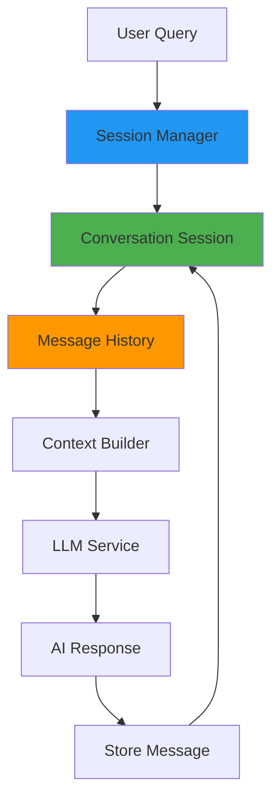

# Conversation Module

**Location**: `services/api/src/conversation/`

**Purpose**: Multi-turn dialogue management with session persistence and context-aware follow-up support.

---

## Architecture



## Core Components

### SessionManager Class

**File**: `session_manager.py`

**Purpose**: Central coordinator for conversation sessions

**Storage**: In-memory dictionary (Redis in production)

#### Key Methods
```python
def create_session(self, metadata: Optional[Dict] = None) -> ConversationSession:
    """Create new conversation session with UUID"""

def get_session(self, session_id: UUID) -> Optional[ConversationSession]:
    """Retrieve existing session by ID"""

def get_or_create_session(self, session_id: Optional[UUID]) -> ConversationSession:
    """Get existing or create new session"""

def delete_session(self, session_id: UUID) -> bool:
    """Remove session and all history"""

def cleanup_expired(self, max_age_hours: int = 24):
    """Remove stale sessions"""
```

### ConversationSession Class

**File**: `session_manager.py`

**Purpose**: Individual conversation state management

**Schema**:
```python
class ConversationSession(BaseModel):
    session_id: UUID = Field(default_factory=uuid4)
    messages: List[Message] = Field(default_factory=list)
    created_at: datetime = Field(default_factory=datetime.utcnow)
    last_active: datetime = Field(default_factory=datetime.utcnow)
    metadata: Dict = Field(default_factory=dict)
```

#### Key Methods
```python
def add_message(self, role: str, content: str, trace_id: Optional[str] = None):
    """Add user or assistant message to history"""

def get_context(self, max_turns: int = 5) -> List[Dict[str, str]]:
    """Get recent conversation for LLM context"""

def get_last_user_query(self) -> Optional[str]:
    """Retrieve most recent user question"""
```

### Message Class

**File**: `session_manager.py`

**Purpose**: Individual message representation

**Schema**:
```python
class Message(BaseModel):
    role: str = Field(..., description="'user' or 'assistant'")
    content: str
    timestamp: datetime = Field(default_factory=datetime.utcnow)
    trace_id: Optional[str] = None
    citations: List[Dict] = Field(default_factory=list)
```

## Session Lifecycle

### Creation
```python
# New session (no session_id provided)
session = session_manager.get_or_create_session(None)
print(f"New session: {session.session_id}")

# Resume existing session
session = session_manager.get_or_create_session(existing_session_id)
print(f"Resumed session: {session.session_id}")
```

### Message Flow
```python
# Add user message
session.add_message("user", "What is diabetes?")

# Generate AI response (external LLM call)
ai_response = await llm_service.generate_answer(...)

# Store AI response
session.add_message("assistant", ai_response, trace_id="abc123")

# Update session activity
session.last_active = datetime.utcnow()
```

### Context Extraction
```python
# Get last 5 conversation turns
context = session.get_context(max_turns=5)

# Example output:
# [
#   {"role": "user", "content": "What is diabetes?"},
#   {"role": "assistant", "content": "Diabetes is a chronic..."},
#   {"role": "user", "content": "How can I prevent it?"},
#   {"role": "assistant", "content": "Prevention includes..."}
# ]
```

## Follow-up Query Understanding

### Context-Aware Processing
```python
# Turn 1
user_query_1 = "What is hypertension?"
session.add_message("user", user_query_1)
ai_response_1 = "Hypertension is high blood pressure..."
session.add_message("assistant", ai_response_1)

# Turn 2 - Follow-up with pronoun reference
user_query_2 = "What are the symptoms?"  # "the symptoms" refers to hypertension
conversation_history = session.get_context(max_turns=3)

# LLM receives full context:
# [
#   {"role": "user", "content": "What is hypertension?"},
#   {"role": "assistant", "content": "Hypertension is..."},
#   {"role": "user", "content": "What are the symptoms?"}
# ]

# LLM understands "symptoms" refers to hypertension symptoms
```

### Pronoun Resolution Examples
```python
# Example conversation flows:

# Medical condition follow-up
Turn 1: "What is diabetes?"
Turn 2: "How do I prevent it?"        # "it" = diabetes
Turn 3: "What are the complications?"  # "the complications" = diabetes complications

# Treatment follow-up
Turn 1: "What is the treatment for hypertension?"
Turn 2: "What are the side effects?"   # "the side effects" = hypertension treatment side effects
Turn 3: "How long does it take?"       # "it" = treatment duration

# Dosage follow-up
Turn 1: "What is the pediatric dose of amoxicillin?"
Turn 2: "How often should it be given?" # "it" = amoxicillin pediatric dose
```

## Session Persistence

### Frontend Integration
```javascript
// localStorage session management
function saveSessionId(sessionId) {
    localStorage.setItem('medarchive_session_id', sessionId);
}

function loadSessionId() {
    return localStorage.getItem('medarchive_session_id');
}

// WebSocket message with session
ws.send(JSON.stringify({
    message: "What is diabetes?",
    session_id: loadSessionId(),  // Persist across page refreshes
    enable_reranking: true,
    max_context_turns: 5
}));
```

### Backend Session Handling
```python
@app.websocket("/api/v1/chat/ws")
async def websocket_chat(websocket: WebSocket):
    while True:
        data = await websocket.receive_json()
        session_id = data.get("session_id")

        # Get or create session
        session = session_manager.get_or_create_session(
            UUID(session_id) if session_id else None
        )

        # Send session ID to client for persistence
        await websocket.send_json({
            "type": "session",
            "session_id": str(session.session_id)
        })

        # Process message with conversation history
        conversation_context = session.get_context(max_turns=5)
        # ... continue processing
```

## Performance Considerations

### In-Memory Storage
```python
# Current implementation (development)
class SessionManager:
    def __init__(self):
        self.sessions: Dict[UUID, ConversationSession] = {}

# Pros: Fast access, simple implementation
# Cons: Lost on restart, no scaling across instances
```

### Production Storage (Redis)
```python
# Production implementation
import redis
import json

class RedisSessionManager:
    def __init__(self, redis_url: str):
        self.redis = redis.from_url(redis_url)

    def create_session(self) -> ConversationSession:
        session = ConversationSession()
        self.redis.setex(
            f"session:{session.session_id}",
            3600 * 24,  # 24 hour expiry
            session.json()
        )
        return session

    def get_session(self, session_id: UUID) -> Optional[ConversationSession]:
        data = self.redis.get(f"session:{session_id}")
        if data:
            return ConversationSession.parse_raw(data)
        return None
```

### Memory Management
```python
# Automatic cleanup
def cleanup_expired(self, max_age_hours: int = 24):
    """Remove sessions older than max_age_hours"""
    now = datetime.utcnow()
    expired = []

    for session_id, session in self.sessions.items():
        age_hours = (now - session.last_active).total_seconds() / 3600
        if age_hours > max_age_hours:
            expired.append(session_id)

    for session_id in expired:
        del self.sessions[session_id]

    logger.info(f"Cleaned up {len(expired)} expired sessions")

# Call periodically
import asyncio
from apscheduler.schedulers.asyncio import AsyncIOScheduler

scheduler = AsyncIOScheduler()
scheduler.add_job(
    session_manager.cleanup_expired,
    'interval',
    hours=1  # Clean up every hour
)
```

## API Integration

### WebSocket Usage
```python
@app.websocket("/api/v1/chat/ws")
async def websocket_chat(websocket: WebSocket):
    await websocket.accept()

    while True:
        # Receive user message
        data = await websocket.receive_json()
        message = data["message"]
        session_id = data.get("session_id")

        # Get/create session
        session = session_manager.get_or_create_session(
            UUID(session_id) if session_id else None
        )

        # Add user message
        session.add_message("user", message)

        # Get conversation context
        context = session.get_context(max_turns=5)

        # Generate response with history
        full_answer = ""
        async for chunk in llm_service.generate_answer_with_history(
            query=message,
            context_chunks=search_results,
            conversation_history=context
        ):
            full_answer += chunk
            await websocket.send_json({"type": "token", "content": chunk})

        # Store AI response
        session.add_message("assistant", full_answer)
```

### REST API Usage
```python
@app.post("/api/v1/chat")
async def chat_endpoint(request: ChatRequest):
    # Get/create session
    session = session_manager.get_or_create_session(request.session_id)

    # Add user message
    session.add_message("user", request.message)

    # Generate response
    answer = await llm_service.generate_answer_with_history(
        query=request.message,
        context_chunks=retrieved_chunks,
        conversation_history=session.get_context()
    )

    # Store response
    trace_id = str(uuid.uuid4())
    session.add_message("assistant", answer, trace_id=trace_id)

    return ChatResponse(
        session_id=session.session_id,
        message=answer,
        trace_id=trace_id
    )
```

## Error Handling

### Session Recovery
```python
try:
    session = session_manager.get_session(session_id)
    if not session:
        logger.warning(f"Session {session_id} not found, creating new session")
        session = session_manager.create_session()
except Exception as e:
    logger.error(f"Session retrieval failed: {e}")
    # Fallback to new session
    session = session_manager.create_session()
```

### Context Overflow
```python
def get_context(self, max_turns: int = 5) -> List[Dict[str, str]]:
    """Get recent conversation turns with overflow protection"""
    try:
        # Limit to recent turns to prevent context overflow
        recent_messages = self.messages[-(max_turns * 2):]

        context = []
        for msg in recent_messages:
            context.append({
                "role": msg.role,
                "content": msg.content[:2000]  # Truncate very long messages
            })

        return context
    except IndexError:
        # Handle empty message list
        return []
```

## Testing

### Session Lifecycle Tests
```python
def test_session_creation():
    manager = SessionManager()

    # Test new session creation
    session = manager.create_session()
    assert session.session_id is not None
    assert len(session.messages) == 0

    # Test session retrieval
    retrieved = manager.get_session(session.session_id)
    assert retrieved.session_id == session.session_id
```

### Conversation Flow Tests
```python
def test_conversation_context():
    session = ConversationSession()

    # Add conversation turns
    session.add_message("user", "What is diabetes?")
    session.add_message("assistant", "Diabetes is a chronic condition...")
    session.add_message("user", "How can I prevent it?")

    # Test context extraction
    context = session.get_context(max_turns=2)
    assert len(context) == 3  # 2 complete turns + 1 partial
    assert context[-1]["content"] == "How can I prevent it?"
```

### Follow-up Understanding Tests
```python
async def test_follow_up_understanding():
    session = ConversationSession()

    # First question about diabetes
    session.add_message("user", "What is diabetes?")
    session.add_message("assistant", "Diabetes is a chronic metabolic disorder...")

    # Follow-up with pronoun reference
    session.add_message("user", "How do I prevent it?")  # "it" = diabetes

    context = session.get_context()

    # Simulate LLM call with context
    response = await llm_service.generate_answer_with_history(
        query="How do I prevent it?",
        context_chunks=diabetes_chunks,
        conversation_history=context
    )

    # Verify response references diabetes prevention
    assert "diabetes prevention" in response.lower()
    assert "type 2 diabetes" in response.lower()
```

## Monitoring

### Session Metrics
```python
# Track session statistics
def get_session_stats(self) -> Dict[str, int]:
    """Get current session statistics"""
    active_sessions = len(self.sessions)
    total_messages = sum(len(s.messages) for s in self.sessions.values())

    return {
        "active_sessions": active_sessions,
        "total_messages": total_messages,
        "avg_messages_per_session": total_messages / max(active_sessions, 1)
    }
```

### Conversation Quality Metrics
```python
# Log conversation patterns
def log_conversation_metrics(session: ConversationSession):
    """Log metrics for conversation analysis"""
    turn_count = len(session.messages) // 2
    avg_user_query_length = np.mean([
        len(msg.content) for msg in session.messages
        if msg.role == "user"
    ])

    logger.info("Conversation completed", extra={
        "session_id": str(session.session_id),
        "turn_count": turn_count,
        "duration_minutes": (session.last_active - session.created_at).total_seconds() / 60,
        "avg_query_length": avg_user_query_length
    })
```

---

**Next**: [Ingestion Module Documentation](ingestion.md)
