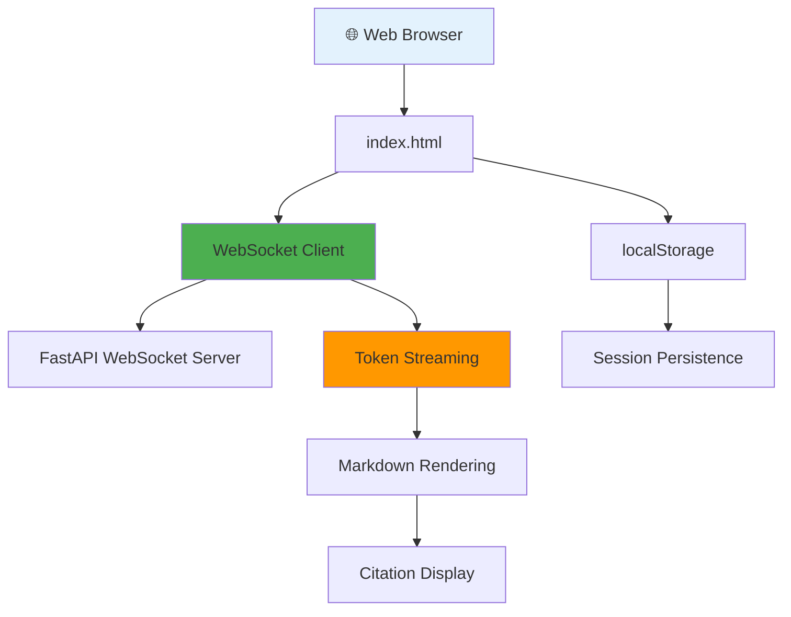

# Frontend Module

**Location**: `static/`

**Purpose**: Real-time web interface for conversational medical AI with WebSocket streaming and session persistence.

---

## Architecture



## Core Components

### HTML Structure

**File**: `index.html`

**Purpose**: Single-page application for medical AI chat interface

#### Layout Structure
```html
<!DOCTYPE html>
<html lang="en">
<head>
    <meta charset="UTF-8">
    <meta name="viewport" content="width=device-width, initial-scale=1.0">
    <title>MedArchive AI - Clinical Decision Support</title>
    <script src="https://cdn.jsdelivr.net/npm/marked/marked.min.js"></script>
</head>
<body>
    <div class="chat-container">
        <!-- Header -->
        <div class="chat-header">
            <h1>🏥 MedArchive AI</h1>
            <button id="newChatBtn" class="new-chat-btn">New Chat</button>
        </div>

        <!-- Messages Area -->
        <div class="chat-messages" id="chatMessages">
            <div class="empty-state">
                <h2>Welcome to MedArchive AI</h2>
                <p>Ask me anything about clinical guidelines, treatments, diagnoses, and medical documentation.</p>
            </div>
        </div>

        <!-- Loading Indicator -->
        <div class="loading">🔍 Processing...</div>

        <!-- Suggested Questions -->
        <div id="suggestedQuestions" class="suggested-questions">
            <strong>💡 Suggested follow-ups:</strong>
            <div id="questionsList"></div>
        </div>

        <!-- Input Area -->
        <div class="chat-input-container">
            <div class="chat-input">
                <textarea id="messageInput" placeholder="Ask about diagnosis, treatment, medications..."></textarea>
                <button id="sendButton">
                    <span>Send</span>
                    <span class="send-icon">📤</span>
                </button>
            </div>
        </div>
    </div>
</body>
</html>
```

### CSS Styling

#### Medical Theme Design
```css
/* Gray medical theme */
body {
    font-family: 'Segoe UI', Tahoma, Geneva, Verdana, sans-serif;
    margin: 0;
    padding: 0;
    background: linear-gradient(135deg, #f5f7fa 0%, #c3cfe2 100%);
    color: #2c3e50;
    line-height: 1.6;
}

.chat-container {
    max-width: 900px;
    margin: 0 auto;
    height: 100vh;
    display: flex;
    flex-direction: column;
    box-shadow: 0 0 20px rgba(0,0,0,0.1);
    background: white;
}

/* Professional header */
.chat-header {
    background: linear-gradient(135deg, #667eea 0%, #764ba2 100%);
    color: white;
    padding: 20px 30px;
    text-align: center;
    position: relative;
}

.chat-header h1 {
    margin: 0;
    font-size: 24px;
    font-weight: 300;
}

.new-chat-btn {
    position: absolute;
    right: 20px;
    top: 50%;
    transform: translateY(-50%);
    background: rgba(255,255,255,0.2);
    border: 1px solid rgba(255,255,255,0.3);
    color: white;
    padding: 8px 16px;
    border-radius: 20px;
    cursor: pointer;
    transition: all 0.3s ease;
}
```

#### Message Styling
```css
/* Message bubbles */
.message {
    display: flex;
    margin: 15px 20px;
    animation: messageSlide 0.4s ease-out;
}

.message.user {
    justify-content: flex-end;
}

.message-content {
    max-width: 70%;
    padding: 15px 20px;
    border-radius: 18px;
    line-height: 1.6;
}

.message.user .message-content {
    background: #667eea;
    color: white;
    border-bottom-right-radius: 4px;
}

.message.assistant .message-content {
    background: white;
    color: #2c3e50;
    border-bottom-left-radius: 4px;
    box-shadow: 0 2px 10px rgba(0,0,0,0.1);
}

/* Citation styling */
.citations {
    margin-top: 12px;
    padding-top: 12px;
    border-top: 2px solid rgba(102,126,234,0.2);
    font-size: 13px;
}

.citation {
    display: inline-block;
    margin: 4px 8px 4px 0;
    padding: 6px 12px;
    background: rgba(102,126,234,0.15);
    border: 1px solid rgba(102,126,234,0.3);
    border-radius: 4px;
    cursor: pointer;
    transition: background-color 0.2s;
}
```

### JavaScript Functionality

#### WebSocket Management
```javascript
// Configuration
const WS_URL = 'ws://127.0.0.1:8001/api/v1/chat/ws';
let ws = null;
let sessionId = null;
let isWaitingForResponse = false;
let currentAssistantMessage = null;
let currentMessageContent = '';

// Session Management
function loadSessionId() {
    const saved = localStorage.getItem('medarchive_session_id');
    if (saved && saved !== 'null') {
        sessionId = saved;
        console.log('Loaded session ID from localStorage:', sessionId);
    }
}

function saveSessionId(newSessionId) {
    if (newSessionId && newSessionId !== 'null') {
        sessionId = newSessionId;
        localStorage.setItem('medarchive_session_id', sessionId);
        console.log('Saved session ID to localStorage:', sessionId);
    }
}

function clearSessionId() {
    sessionId = null;
    localStorage.removeItem('medarchive_session_id');
    console.log('Cleared session ID from localStorage');
}

// WebSocket Connection
function connectWebSocket() {
    ws = new WebSocket(WS_URL);

    ws.onopen = () => {
        console.log('WebSocket connected');
        loadSessionId(); // Load persisted session ID
    };

    ws.onmessage = (event) => {
        const message = JSON.parse(event.data);
        handleWebSocketMessage(message);
    };

    ws.onerror = (error) => {
        console.error('WebSocket error:', error);
        addMessage('assistant', '❌ Connection error. Please refresh the page.', null, true);
    };

    ws.onclose = () => {
        console.log('WebSocket disconnected');
        setTimeout(() => {
            console.log('Attempting to reconnect...');
            connectWebSocket();
        }, 3000);
    };
}
```

#### Message Handling
```javascript
// Handle WebSocket messages
function handleWebSocketMessage(message) {
    switch (message.type) {
        case 'session':
            saveSessionId(message.session_id);
            break;

        case 'typing':
            updateTypingIndicator(message.status);
            break;

        case 'token':
            appendToCurrentMessage(message.content);
            break;

        case 'complete':
            finalizeMessage(message.citations, message.suggested_questions);
            break;

        case 'error':
            console.error('Server error:', message.message);
            addMessage('assistant', `❌ ${message.message}`, null, true);
            resetUIState();
            break;
    }
}

// Real-time token streaming
function appendToCurrentMessage(token) {
    if (!currentAssistantMessage) {
        // Create new assistant message bubble
        currentAssistantMessage = document.createElement('div');
        currentAssistantMessage.className = 'message assistant';

        const contentDiv = document.createElement('div');
        contentDiv.className = 'message-content';
        const messageId = 'msg-' + Date.now();
        contentDiv.id = messageId;
        contentDiv.dataset.messageId = messageId;

        currentAssistantMessage.appendChild(contentDiv);
        chatMessages.appendChild(currentAssistantMessage);

        currentMessageContent = '';
    }

    // Hide loading, show streaming content
    loadingDiv.classList.remove('active');

    // Append token
    currentMessageContent += token;
    const contentDiv = currentAssistantMessage.querySelector('.message-content');

    if (contentDiv) {
        // Render markdown in real-time
        contentDiv.innerHTML = marked.parse(currentMessageContent);
    }

    // Scroll to bottom
    chatMessages.scrollTop = chatMessages.scrollHeight;
}
```

#### Message Sending
```javascript
function sendMessage() {
    const message = messageInput.value.trim();

    if (!message || isWaitingForResponse) {
        return;
    }

    // Clear input
    messageInput.value = '';

    // Remove empty state if present
    const emptyState = chatMessages.querySelector('.empty-state');
    if (emptyState) emptyState.remove();

    // Add user message
    addMessage('user', message);

    // Reset current message state
    currentAssistantMessage = null;
    currentMessageContent = '';

    // Show loading
    isWaitingForResponse = true;
    sendButton.disabled = true;
    loadingDiv.classList.add('active');
    suggestedQuestionsDiv.style.display = 'none';

    // Send via WebSocket
    ws.send(JSON.stringify({
        message: message,
        session_id: sessionId,
        enable_reranking: true,
        max_context_turns: 5
    }));
}
```

#### Session Management
```javascript
// Start new chat session
function startNewChat() {
    // Clear session completely
    clearSessionId();
    currentAssistantMessage = null;
    currentMessageContent = '';
    isWaitingForResponse = false;

    // Clear chat messages and show empty state
    chatMessages.innerHTML = `
        <div class="empty-state">
            <h2>Welcome to MedArchive AI</h2>
            <p>Ask me anything about clinical guidelines, treatments, diagnoses, and medical documentation.</p>
            <p style="margin-top: 20px; font-size: 13px;">Examples: "What is the first-line treatment for hypertension?" or "What are the complications of diabetes?"</p>
        </div>
    `;

    // Hide suggested questions
    suggestedQuestionsDiv.style.display = 'none';

    // Reset input and button
    messageInput.value = '';
    sendButton.disabled = false;
    isWaitingForResponse = false;
    loadingDiv.classList.remove('active');

    // Focus input
    messageInput.focus();
}
```

### Citation Display

#### Citation Rendering
```javascript
function finalizeMessage(citations, suggestedQuestions) {
    if (!currentAssistantMessage) return;

    // Reset UI state
    resetUIState();

    // Add citations if available
    if (citations && citations.length > 0) {
        const citationsDiv = document.createElement('div');
        citationsDiv.className = 'citations';

        let citationsHTML = '<strong>📚 Sources:</strong><br>';
        citations.forEach((citation, index) => {
            const pageInfo = citation.page_numbers && citation.page_numbers.length > 0
                ? ` (p. ${citation.page_numbers.join(', ')})`
                : '';

            citationsHTML += `
                <div class="citation" title="${citation.text_snippet}" data-relevance="${citation.relevance_score}">
                    [${index + 1}] ${citation.document_title}${pageInfo}
                </div>
            `;
        });

        citationsDiv.innerHTML = citationsHTML;

        // Add citations to current message
        const messageContent = currentAssistantMessage.querySelector('.message-content');
        messageContent.appendChild(citationsDiv);
    }

    // Show suggested questions
    if (suggestedQuestions && suggestedQuestions.length > 0) {
        showSuggestedQuestions(suggestedQuestions);
    }

    // Clear current message reference
    currentAssistantMessage = null;
}
```

#### Suggested Questions
```javascript
function showSuggestedQuestions(questions) {
    if (!questions || questions.length === 0) {
        suggestedQuestionsDiv.style.display = 'none';
        return;
    }

    // Clear existing questions
    questionsListDiv.innerHTML = '';

    // Add each suggested question as clickable button
    questions.forEach(question => {
        const questionBtn = document.createElement('button');
        questionBtn.className = 'suggested-question';
        questionBtn.textContent = question;
        questionBtn.onclick = () => {
            messageInput.value = question;
            sendMessage();
        };
        questionsListDiv.appendChild(questionBtn);
    });

    suggestedQuestionsDiv.style.display = 'block';
}
```

### Responsive Design

#### Mobile Optimization
```css
/* Mobile responsive design */
@media (max-width: 768px) {
    .chat-container {
        height: 100vh;
        max-width: 100%;
    }

    .chat-header {
        padding: 15px 20px;
    }

    .chat-header h1 {
        font-size: 20px;
    }

    .message {
        margin: 10px 15px;
    }

    .message-content {
        max-width: 85%;
        padding: 12px 16px;
    }

    .chat-input-container {
        padding: 10px 15px;
    }

    .new-chat-btn {
        position: relative;
        right: auto;
        top: auto;
        transform: none;
        margin-top: 10px;
        display: block;
    }
}

/* Tablet optimization */
@media (max-width: 1024px) and (min-width: 769px) {
    .chat-container {
        max-width: 100%;
        margin: 0;
    }

    .message-content {
        max-width: 80%;
    }
}
```

### Loading States

#### Typing Indicators
```javascript
function updateTypingIndicator(status) {
    const statusText = {
        'retrieving': '🔍 Searching documents...',
        'reranking': '📊 Ranking results...',
        'generating': '✍️ Writing response...'
    };

    loadingDiv.textContent = statusText[status] || 'Processing...';
    loadingDiv.classList.add('active');
}
```

#### Loading Animation CSS
```css
.loading {
    text-align: center;
    padding: 15px;
    color: #667eea;
    font-style: italic;
    display: none;
}

.loading.active {
    display: block;
    animation: pulse 1.5s ease-in-out infinite;
}

@keyframes pulse {
    0%, 100% { opacity: 0.7; }
    50% { opacity: 1; }
}

/* Typing dots animation */
.loading-dots {
    display: inline-block;
}

.loading-dots span {
    animation: blink 1.4s infinite;
    display: inline-block;
    margin: 0 2px;
}

.loading-dots span:nth-child(2) {
    animation-delay: 0.2s;
}

.loading-dots span:nth-child(3) {
    animation-delay: 0.4s;
}

@keyframes blink {
    0%, 80%, 100% { opacity: 0; }
    40% { opacity: 1; }
}
```

### Event Handling

#### Keyboard Shortcuts
```javascript
// Event listeners
sendButton.addEventListener('click', sendMessage);

messageInput.addEventListener('keypress', (e) => {
    if (e.key === 'Enter' && !e.shiftKey) {
        e.preventDefault();
        sendMessage();
    }
});

// Auto-resize textarea
messageInput.addEventListener('input', () => {
    messageInput.style.height = 'auto';
    messageInput.style.height = messageInput.scrollHeight + 'px';
});

// New chat button
document.getElementById('newChatBtn').addEventListener('click', startNewChat);
```

#### Window Events
```javascript
// Handle page refresh/reload
window.addEventListener('beforeunload', () => {
    if (ws && ws.readyState === WebSocket.OPEN) {
        ws.close();
    }
});

// Handle visibility changes
document.addEventListener('visibilitychange', () => {
    if (document.visibilityState === 'visible') {
        // Reconnect WebSocket if needed
        if (!ws || ws.readyState === WebSocket.CLOSED) {
            connectWebSocket();
        }
    }
});
```

## Performance Optimizations

### Efficient Rendering
```javascript
// Debounced markdown rendering for streaming
function debounce(func, wait) {
    let timeout;
    return function executedFunction(...args) {
        const later = () => {
            clearTimeout(timeout);
            func(...args);
        };
        clearTimeout(timeout);
        timeout = setTimeout(later, wait);
    };
}

const debouncedRender = debounce((content, element) => {
    element.innerHTML = marked.parse(content);
}, 50); // Render every 50ms during streaming

function appendToCurrentMessage(token) {
    currentMessageContent += token;
    const contentDiv = currentAssistantMessage.querySelector('.message-content');

    if (contentDiv) {
        // Use debounced rendering for better performance
        debouncedRender(currentMessageContent, contentDiv);
    }
}
```

### Memory Management
```javascript
// Clean up old messages to prevent memory leaks
function cleanupOldMessages() {
    const messages = chatMessages.querySelectorAll('.message');

    // Keep only last 50 messages
    if (messages.length > 50) {
        for (let i = 0; i < messages.length - 50; i++) {
            messages[i].remove();
        }
    }
}

// Call cleanup periodically
setInterval(cleanupOldMessages, 30000); // Every 30 seconds
```

## Error Handling

### Connection Recovery
```javascript
function handleConnectionError() {
    console.log('Connection lost, attempting recovery...');

    // Show user-friendly error
    addMessage('assistant', '🔄 Connection lost. Reconnecting...', null, true);

    // Attempt reconnection
    setTimeout(() => {
        connectWebSocket();
    }, 2000);
}

// Enhanced error handling
ws.onerror = (error) => {
    console.error('WebSocket error:', error);
    handleConnectionError();
};

ws.onclose = (event) => {
    console.log('WebSocket closed:', event.code, event.reason);

    if (event.code !== 1000) { // Not a normal closure
        handleConnectionError();
    }
};
```

### Input Validation
```javascript
function validateMessage(message) {
    // Check message length
    if (message.length > 1000) {
        addMessage('assistant', '⚠️ Message too long. Please limit to 1000 characters.', null, true);
        return false;
    }

    // Check for empty/whitespace only
    if (!message.trim()) {
        messageInput.focus();
        return false;
    }

    // Basic content filtering
    const prohibited = ['<script>', 'javascript:', 'data:'];
    const lowerMessage = message.toLowerCase();

    for (const term of prohibited) {
        if (lowerMessage.includes(term)) {
            addMessage('assistant', '⚠️ Message contains prohibited content.', null, true);
            return false;
        }
    }

    return true;
}

function sendMessage() {
    const message = messageInput.value.trim();

    if (!validateMessage(message) || isWaitingForResponse) {
        return;
    }

    // ... rest of send logic
}
```

## Accessibility Features

### Screen Reader Support
```html
<!-- ARIA labels for accessibility -->
<div class="chat-messages" id="chatMessages" role="log" aria-live="polite" aria-label="Chat conversation">
    <!-- Messages appear here -->
</div>

<textarea
    id="messageInput"
    placeholder="Ask about diagnosis, treatment, medications..."
    aria-label="Type your medical question"
    role="textbox"
    aria-multiline="true">
</textarea>

<button id="sendButton" aria-label="Send message">
    <span>Send</span>
    <span class="send-icon" aria-hidden="true">📤</span>
</button>
```

### Keyboard Navigation
```css
/* Focus indicators */
button:focus, textarea:focus {
    outline: 2px solid #667eea;
    outline-offset: 2px;
}

.citation:focus {
    background: rgba(102,126,234,0.35);
    outline: 2px solid #667eea;
}

/* High contrast mode support */
@media (prefers-contrast: high) {
    .message.user .message-content {
        background: #000;
        border: 2px solid #fff;
    }

    .message.assistant .message-content {
        background: #fff;
        border: 2px solid #000;
    }
}
```

## Usage Examples

### Basic Integration
```html
<!-- Minimal integration -->
<!DOCTYPE html>
<html>
<head>
    <title>Medical AI Chat</title>
    <script src="https://cdn.jsdelivr.net/npm/marked/marked.min.js"></script>
</head>
<body>
    <div id="chat-container"></div>
    <script src="medarchive-chat.js"></script>
    <script>
        // Initialize chat interface
        MedArchiveChat.init({
            container: '#chat-container',
            wsUrl: 'ws://localhost:8001/api/v1/chat/ws',
            theme: 'medical-gray'
        });
    </script>
</body>
</html>
```

### Custom Styling
```css
/* Override default theme */
.custom-theme .chat-header {
    background: linear-gradient(135deg, #2c3e50 0%, #3498db 100%);
}

.custom-theme .message.user .message-content {
    background: #3498db;
}

.custom-theme .citation {
    background: rgba(52,152,219,0.15);
    border-color: rgba(52,152,219,0.3);
}
```

### Event Listeners
```javascript
// Custom event handling
document.addEventListener('medarchive:messageReceived', (event) => {
    console.log('New message:', event.detail);
});

document.addEventListener('medarchive:sessionStarted', (event) => {
    console.log('Session ID:', event.detail.sessionId);
});

document.addEventListener('medarchive:citationsReceived', (event) => {
    console.log('Citations:', event.detail.citations);
});
```

---

**That completes the comprehensive module documentation for MedArchive RAG!**

**Module Documentation Index:**
- [🔍 Retrieval Module](retrieval.md) - Vector search and reranking
- [🧠 LLM Module](llm.md) - Groq integration and streaming
- [💬 Conversation Module](conversation.md) - Session management
- [📄 Ingestion Module](ingestion.md) - PDF processing pipeline
- [🔗 Citations Module](citations.md) - Source attribution
- [🌐 Frontend Module](frontend.md) - Web interface (this document)
