# Ingestion Module

**Location**: `services/ingestion/src/`

**Purpose**: Background pipeline for processing medical PDFs into searchable vector chunks with semantic understanding.

---

## Architecture

```mermaid
graph TB
    PDF[📄 PDF Files] --> Detect[File Detection]
    Detect --> Parse[LlamaParse]
    Parse --> Chunk[Semantic Chunker]
    Chunk --> Embed[BGE Embeddings]
    Embed --> Index[Qdrant Indexer]
    Index --> VDB[(Vector Database)]

    FileSync[File Sync] --> Detect
    HashCheck[Hash Check] --> FileSync

    style PDF fill:#e3f2fd
    style Parse fill:#f1f8e9
    style VDB fill:#fce4ec
```



## Core Components

### 1. File Synchronization (`sync/`)

**Purpose**: Detect new/changed PDF files for processing

**File**: `file_sync.py`

#### Key Features
- MD5 hash-based change detection
- JSON registry for processed files
- Incremental sync to avoid reprocessing
- File modification timestamp tracking

```python
class FileSync:
    def detect_changes(self, directory: str) -> List[FileChange]:
        """Detect new, modified, or deleted PDFs"""

    def update_registry(self, file_path: str, file_hash: str):
        """Record processed file in registry"""

    def is_processed(self, file_path: str) -> bool:
        """Check if file already processed"""
```

#### File Registry Structure
```json
{
    "diabetes_guidelines.pdf": {
        "hash": "a1b2c3d4e5f6...",
        "processed_at": "2026-02-12T10:30:00Z",
        "chunk_count": 45,
        "file_size": 2048576
    }
}
```

### 2. PDF Parsing (`parsers/`)

**Purpose**: Extract structured text and tables from medical PDFs

**File**: `llama_parse_client.py`

#### LlamaParse Integration
```python
class LlamaParseClient:
    def __init__(self, api_key: str):
        self.client = LlamaParse(api_key=api_key)

    async def parse_pdf(self, file_path: str) -> ParsedDocument:
        """Extract text with table structure preservation"""

    def _extract_tables(self, markdown: str) -> List[Table]:
        """Parse markdown tables into structured data"""
```

#### Table-Aware Parsing
```python
# Input PDF table
| Drug | Pediatric Dose | Adult Dose |
|------|----------------|------------|
| Amoxicillin | 15mg/kg BID | 500mg TID |
| Azithromycin | 10mg/kg QD | 250mg QD |

# LlamaParse output (Markdown)
"""## Antibiotic Dosing Guidelines

| Drug | Pediatric Dose | Adult Dose |
|------|----------------|------------|
| Amoxicillin | 15mg/kg BID | 500mg TID |
| Azithromycin | 10mg/kg QD | 250mg QD |

*Note: Adjust for renal function*"""

# Structured extraction
tables = [
    {
        "caption": "Antibiotic Dosing Guidelines",
        "headers": ["Drug", "Pediatric Dose", "Adult Dose"],
        "rows": [
            ["Amoxicillin", "15mg/kg BID", "500mg TID"],
            ["Azithromycin", "10mg/kg QD", "250mg QD"]
        ],
        "notes": ["Adjust for renal function"]
    }
]
```

### 3. Semantic Chunking (`chunking/`)

**Purpose**: Intelligent text segmentation preserving semantic coherence

**File**: `semantic_chunker.py`

#### Chunking Strategy
```python
class SemanticChunker:
    def __init__(
        self,
        chunk_size: int = 400,        # Target tokens per chunk
        chunk_overlap: int = 50,      # Overlap for context preservation
        max_recursion_depth: int = 5  # Prevent infinite recursion
    ):
```

#### Chunking Hierarchy
```python
CHUNKING_SEPARATORS = [
    "\n\n\n",        # Section breaks
    "\n\n",          # Paragraph breaks
    "\n",            # Line breaks
    ". ",            # Sentence breaks
    ", ",            # Clause breaks
    " ",             # Word breaks
]

def _split_text_recursive(
    text: str,
    separators: List[str],
    depth: int = 0
) -> List[str]:
    """Recursively split text maintaining semantic boundaries"""

    if depth > self.max_recursion_depth:
        logger.warning(f"Max recursion depth reached, forcing split")
        return self._force_split(text)

    # Try each separator in order
    for separator in separators:
        if separator in text:
            return self._split_by_separator(text, separator, depth)

    # No separator found, return as single chunk
    return [text]
```

#### Chunk Metadata
```python
class TextChunk:
    chunk_id: str               # Unique identifier
    document_id: str           # Source document ID
    text: str                  # Chunk content
    token_count: int           # Approximate token count
    char_count: int            # Character count
    chunk_index: int           # Position in document
    section_path: str          # Hierarchical path ("Ch1 > Sec2 > Subsec3")
    page_numbers: List[int]    # Source page numbers
    tables_present: bool       # Contains table data
    word_count: int            # Word count
    created_at: datetime       # Processing timestamp
```

### 4. Embedding Generation (`embedding/`)

**Purpose**: Convert text chunks to high-dimensional vectors

**File**: `service.py`

#### BGE-Large Integration
```python
class EmbeddingService:
    def __init__(self, model_name: str = "BAAI/bge-large-en-v1.5"):
        self.model = SentenceTransformer(model_name)
        self.dimensions = 1024  # BGE-Large output size

    def embed_chunks(self, chunks: List[TextChunk]) -> List[np.ndarray]:
        """Generate embeddings for text chunks"""
        texts = [chunk.text for chunk in chunks]
        embeddings = self.model.encode(
            texts,
            batch_size=32,
            show_progress_bar=True,
            normalize_embeddings=True  # Unit vectors for cosine similarity
        )
        return embeddings
```

#### Batch Processing
```python
# Efficient batched embedding generation
def process_document_embeddings(self, document: ParsedDocument) -> List[EmbeddedChunk]:
    """Process entire document with batched embeddings"""

    # Chunk the document
    chunks = self.chunker.chunk_document(document)

    # Batch embed all chunks
    embeddings = self.embedding_service.embed_chunks(chunks)

    # Combine chunks with embeddings
    embedded_chunks = []
    for chunk, embedding in zip(chunks, embeddings):
        embedded_chunk = EmbeddedChunk(
            **chunk.dict(),
            embedding=embedding.tolist(),
            embedding_model="BAAI/bge-large-en-v1.5"
        )
        embedded_chunks.append(embedded_chunk)

    return embedded_chunks
```

### 5. Vector Indexing (`indexing/`)

**Purpose**: Store embedded chunks in Qdrant vector database

**File**: `qdrant_indexer.py`

#### Qdrant Integration
```python
class QdrantIndexer:
    def __init__(self, qdrant_url: str, collection_name: str):
        self.client = QdrantClient(url=qdrant_url)
        self.collection_name = collection_name

    async def create_collection(self):
        """Initialize collection with BGE-Large vector config"""
        self.client.create_collection(
            collection_name=self.collection_name,
            vectors_config=VectorParams(
                size=1024,                    # BGE-Large dimensions
                distance=Distance.COSINE      # Cosine similarity
            )
        )
```

#### Batch Indexing
```python
def index_chunks(self, embedded_chunks: List[EmbeddedChunk]) -> int:
    """Index embedded chunks in batches"""

    points = []
    for chunk in embedded_chunks:
        point = PointStruct(
            id=chunk.chunk_id,
            vector=chunk.embedding,
            payload={
                "document_id": chunk.document_id,
                "text": chunk.text,
                "source_file": chunk.source_file,
                "page_numbers": chunk.page_numbers,
                "section_path": chunk.section_path,
                "chunk_index": chunk.chunk_index,
                "word_count": chunk.word_count,
                "created_at": chunk.created_at.isoformat()
            }
        )
        points.append(point)

    # Batch insert
    result = self.client.upsert(
        collection_name=self.collection_name,
        points=points,
        wait=True
    )

    return len(points)
```

## Processing Pipeline

### Main Orchestrator

**File**: `main.py`

```python
class IngestionPipeline:
    def __init__(self):
        self.file_sync = FileSync()
        self.parser = LlamaParseClient(api_key=settings.llamaparse_api_key)
        self.chunker = SemanticChunker()
        self.embedder = EmbeddingService()
        self.indexer = QdrantIndexer(settings.qdrant_url, settings.collection_name)

    async def run(self, document_directory: str):
        """Execute full ingestion pipeline"""

        # 1. Detect file changes
        changes = self.file_sync.detect_changes(document_directory)
        logger.info(f"Detected {len(changes)} file changes")

        # 2. Process each changed file
        total_chunks = 0
        for change in changes:
            if change.change_type in ["added", "modified"]:
                chunks_processed = await self._process_file(change.file_path)
                total_chunks += chunks_processed

                # Update registry
                file_hash = self.file_sync.calculate_hash(change.file_path)
                self.file_sync.update_registry(change.file_path, file_hash)

        logger.info(f"Pipeline complete: {total_chunks} chunks indexed")

    async def _process_file(self, file_path: str) -> int:
        """Process single PDF file through pipeline"""

        logger.info(f"Processing {file_path}")

        try:
            # Parse PDF
            document = await self.parser.parse_pdf(file_path)

            # Chunk text
            chunks = self.chunker.chunk_document(document)
            logger.info(f"Created {len(chunks)} chunks")

            # Generate embeddings
            embeddings = self.embedder.embed_chunks(chunks)

            # Combine chunks with embeddings
            embedded_chunks = [
                EmbeddedChunk(**chunk.dict(), embedding=emb.tolist())
                for chunk, emb in zip(chunks, embeddings)
            ]

            # Index in vector database
            indexed_count = self.indexer.index_chunks(embedded_chunks)
            logger.info(f"Indexed {indexed_count} chunks from {file_path}")

            return indexed_count

        except Exception as e:
            logger.error(f"Failed to process {file_path}: {e}")
            return 0
```

### Command Line Interface

```python
if __name__ == "__main__":
    import asyncio
    from pathlib import Path

    async def main():
        # Initialize pipeline
        pipeline = IngestionPipeline()

        # Document directory
        doc_dir = Path("data/document_store")
        doc_dir.mkdir(exist_ok=True)

        # Run pipeline
        await pipeline.run(str(doc_dir))

    # Execute
    asyncio.run(main())
```

## Configuration

### Pipeline Settings
```python
# Text chunking
CHUNK_SIZE = 400                # Target tokens per chunk
CHUNK_OVERLAP = 50              # Context preservation
MAX_RECURSION_DEPTH = 5         # Chunking safety limit

# Embedding
EMBEDDING_MODEL = "BAAI/bge-large-en-v1.5"
EMBEDDING_BATCH_SIZE = 32       # GPU memory optimization
EMBEDDING_DIMENSIONS = 1024     # BGE-Large output size

# Vector indexing
VECTOR_DISTANCE = "COSINE"       # Similarity metric
INDEX_BATCH_SIZE = 100          # Qdrant batch size

# File processing
SUPPORTED_FORMATS = [".pdf"]    # Supported file types
MAX_FILE_SIZE_MB = 50           # File size limit
PROCESSING_TIMEOUT = 300        # Seconds per file
```

### Environment Variables
```bash
# Required API keys
LLAMAPARSE_API_KEY="llx-..."

# Vector database
QDRANT_URL="http://localhost:6333"
QDRANT_COLLECTION_NAME="medarchive_docs"

# Document storage
DOCUMENT_STORE_PATH="data/document_store"
FILE_REGISTRY_PATH="data/.file_registry.json"

# Logging
LOG_LEVEL="INFO"
LOG_FORMAT="json"
```

## Error Handling

### File Processing Errors
```python
try:
    document = await self.parser.parse_pdf(file_path)
except LlamaParseError as e:
    if "rate_limit" in str(e).lower():
        logger.warning(f"Rate limited, waiting 60s: {e}")
        await asyncio.sleep(60)
        document = await self.parser.parse_pdf(file_path)  # Retry
    else:
        logger.error(f"Parse failed for {file_path}: {e}")
        return 0
except asyncio.TimeoutError:
    logger.error(f"Parse timeout for {file_path}")
    return 0
```

### Vector Database Errors
```python
try:
    self.indexer.index_chunks(embedded_chunks)
except QdrantException as e:
    if "collection_not_found" in str(e).lower():
        logger.info("Creating missing collection")
        await self.indexer.create_collection()
        self.indexer.index_chunks(embedded_chunks)  # Retry
    else:
        logger.error(f"Indexing failed: {e}")
        raise
```

### Memory Management
```python
def process_large_document(self, file_path: str):
    """Process large PDFs in chunks to avoid memory issues"""

    file_size_mb = os.path.getsize(file_path) / (1024 * 1024)

    if file_size_mb > 20:  # Large file threshold
        # Process in pages/sections
        for page_range in self._split_large_pdf(file_path):
            partial_doc = self.parser.parse_pdf_pages(file_path, page_range)
            self._process_partial_document(partial_doc)

            # Clear memory
            del partial_doc
            gc.collect()
    else:
        # Standard processing
        document = self.parser.parse_pdf(file_path)
        self._process_document(document)
```

## Performance Monitoring

### Processing Metrics
```python
class PipelineMetrics:
    def __init__(self):
        self.files_processed = 0
        self.chunks_created = 0
        self.embeddings_generated = 0
        self.indexing_time_total = 0

    def log_file_completion(self, file_path: str, chunk_count: int, duration: float):
        """Log completion metrics for file"""

        self.files_processed += 1
        self.chunks_created += chunk_count

        logger.info("File processing completed", extra={
            "file_path": file_path,
            "chunk_count": chunk_count,
            "duration_seconds": duration,
            "chunks_per_second": chunk_count / max(duration, 0.1)
        })

    def get_summary(self) -> Dict[str, Any]:
        """Get processing summary"""
        return {
            "files_processed": self.files_processed,
            "total_chunks": self.chunks_created,
            "avg_chunks_per_file": self.chunks_created / max(self.files_processed, 1),
            "total_indexing_time": self.indexing_time_total
        }
```

### Health Checks
```python
def verify_pipeline_health(self) -> Dict[str, bool]:
    """Check pipeline component health"""

    health = {}

    # Check LlamaParse API
    try:
        self.parser.test_connection()
        health["llamaparse"] = True
    except Exception:
        health["llamaparse"] = False

    # Check embedding model
    try:
        test_embedding = self.embedder.embed_text("test")
        health["embeddings"] = len(test_embedding) == 1024
    except Exception:
        health["embeddings"] = False

    # Check Qdrant connection
    try:
        collection_info = self.indexer.client.get_collection(self.collection_name)
        health["qdrant"] = collection_info is not None
    except Exception:
        health["qdrant"] = False

    return health
```

## Usage Examples

### Manual Pipeline Run
```bash
# Process specific directory
python -m services.ingestion.src.main

# Process with specific collection
QDRANT_COLLECTION_NAME="test_docs" python -m services.ingestion.src.main

# Debug mode with detailed logging
LOG_LEVEL="DEBUG" python -m services.ingestion.src.main
```

### Programmatic Usage
```python
from services.ingestion.src.main import IngestionPipeline

# Initialize
pipeline = IngestionPipeline()

# Process specific file
chunk_count = await pipeline._process_file("clinical_guidelines.pdf")
print(f"Processed {chunk_count} chunks")

# Check pipeline health
health = pipeline.verify_pipeline_health()
if all(health.values()):
    print("Pipeline healthy")
else:
    print(f"Pipeline issues: {health}")
```

### Scheduled Processing
```python
import asyncio
from apscheduler.schedulers.asyncio import AsyncIOScheduler

async def scheduled_ingestion():
    """Run ingestion pipeline on schedule"""
    pipeline = IngestionPipeline()
    await pipeline.run("data/document_store")

# Run every hour
scheduler = AsyncIOScheduler()
scheduler.add_job(
    scheduled_ingestion,
    'interval',
    hours=1,
    id='ingestion_pipeline'
)

scheduler.start()
```

---

**Next**: [Citations Module Documentation](citations.md)
