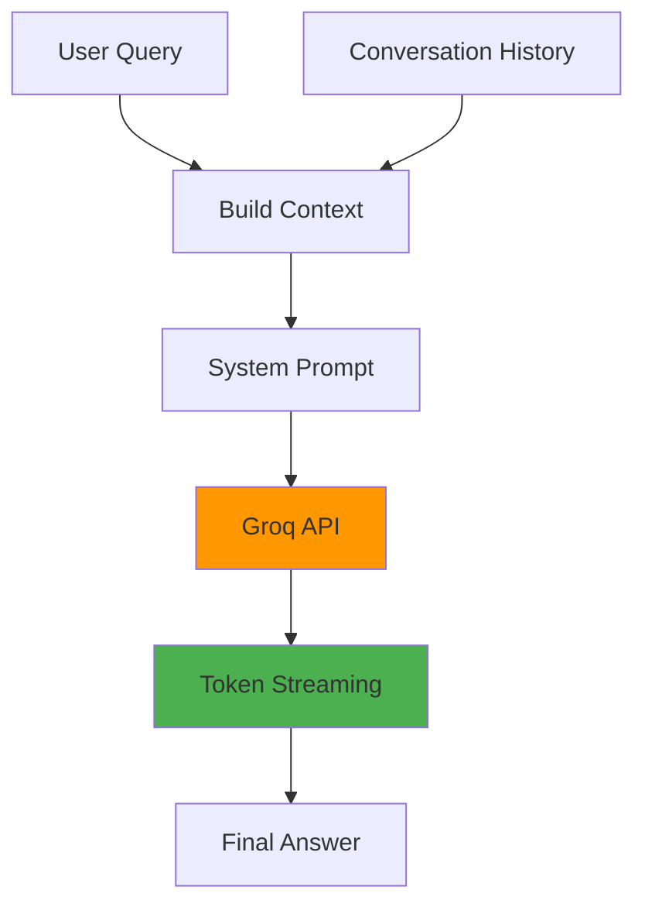

# LLM Module

**Location**: `services/api/src/llm/`

**Purpose**: Groq API integration for ultra-fast medical question answering with streaming support.

---

## Architecture



## Core Components

### LLMService Class

**File**: `__init__.py`

**Purpose**: Primary interface for answer generation

**Model**: `llama-3.3-70b-versatile` (280 tokens/sec)

### Key Methods

#### Streaming Generation
```python
async def generate_answer_stream(
    query: str,
    context_chunks: List[SearchResult]
) -> AsyncGenerator[str, None]:
    """Stream answer tokens in real-time"""
```

#### Conversation-Aware Generation
```python
async def generate_answer_with_history(
    query: str,
    context_chunks: List[SearchResult],
    conversation_history: List[Dict[str, str]],
    stream: bool = False
) -> str:
    """Generate contextual answers with conversation memory"""
```

#### Raw Message Generation
```python
async def generate_answer_stream_from_messages(
    messages: List[Dict[str, str]]
) -> AsyncGenerator[str, None]:
    """Direct Groq API streaming with custom message array"""
```

## Prompt Engineering

### System Prompt
```python
SYSTEM_PROMPT = """
You are MedArchive AI, a clinical decision support assistant.

Guidelines:
- Provide accurate medical information based ONLY on the context provided
- Always cite sources with [Source X] notation
- If information is insufficient, clearly state limitations
- Use clear, clinical language appropriate for healthcare professionals
- Never speculate or provide information not in the context
- For drug dosages, include exact citations with page numbers
"""
```

### Context Building
```python
def _build_context(self, chunks: List[SearchResult]) -> str:
    """Format retrieved chunks into structured context"""
    context_parts = []
    for i, chunk in enumerate(chunks, 1):
        source_info = f"[Source {i}]"
        if chunk.source_file:
            source_info += f" {chunk.source_file}"
        if chunk.page_numbers:
            pages = ", ".join(str(p) for p in chunk.page_numbers)
            source_info += f" (Page {pages})"

        context_parts.append(f"{source_info}\n{chunk.text}\n")

    return "\n".join(context_parts)
```

### Message Structure
```python
messages = [
    {"role": "system", "content": system_prompt},
    {"role": "user", "content": "What is diabetes?"},
    {"role": "assistant", "content": "Diabetes is..."},
    {"role": "user", "content": current_query_with_context}
]
```

## Configuration

```python
# Performance settings
MODEL = "llama-3.3-70b-versatile"  # Groq's fastest model
TEMPERATURE = 0.1                   # Low for medical accuracy
MAX_TOKENS = 2048                   # Comprehensive answers
TOP_P = 0.9                         # Nucleus sampling
STREAM = True                       # Real-time token delivery

# Context limits
MAX_CONTEXT_LENGTH = 16384          # Token limit for context
MAX_HISTORY_TURNS = 4               # Conversation memory depth
```

## Streaming Implementation

### WebSocket Streaming
```python
async def stream_to_websocket(websocket: WebSocket, query: str, context: str):
    """Stream LLM response to WebSocket client"""
    full_answer = ""

    async for chunk in llm_service.generate_answer_stream(query, context):
        full_answer += chunk
        await websocket.send_json({
            "type": "token",
            "content": chunk
        })

    return full_answer
```

### HTTP Streaming
```python
@app.post("/api/v1/query/stream")
async def stream_query(request: QueryRequest):
    """HTTP Server-Sent Events streaming"""

    async def generate():
        async for chunk in llm_service.generate_answer_stream(
            query=request.query,
            context_chunks=search_results
        ):
            yield f"data: {json.dumps({'token': chunk})}\n\n"

    return StreamingResponse(generate(), media_type="text/plain")
```

## Performance Metrics

| Metric | Target | Actual |
|--------|--------|---------|
| First Token Latency | <200ms | ~100ms |
| Token Generation Rate | >200 tok/sec | ~280 tok/sec |
| Context Processing | <100ms | ~50ms |
| Memory Usage | <2GB | ~1.5GB |

## Error Handling

### Rate Limiting
```python
from groq import RateLimitError

try:
    response = await client.chat.completions.create(...)
except RateLimitError as e:
    logger.warning(f"Groq rate limit hit: {e}")
    await asyncio.sleep(e.retry_after)
    # Implement exponential backoff
```

### Context Overflow
```python
def _truncate_context(self, context: str, max_tokens: int) -> str:
    """Truncate context to fit model limits"""
    if self._count_tokens(context) > max_tokens:
        # Keep most recent context chunks
        chunks = context.split("\n\n")
        truncated = ""
        for chunk in reversed(chunks):
            if self._count_tokens(truncated + chunk) < max_tokens:
                truncated = chunk + "\n\n" + truncated
            else:
                break
        return truncated
    return context
```

## Conversation Memory

### Context Window Management
```python
def get_conversation_context(
    session: ConversationSession,
    max_turns: int = 4
) -> List[Dict[str, str]]:
    """Extract recent conversation for context"""
    # Get last N turns (user + assistant pairs)
    recent_messages = session.messages[-(max_turns * 2):]

    return [
        {"role": msg.role, "content": msg.content}
        for msg in recent_messages
    ]
```

### Follow-up Understanding
```python
# Example conversation flow
Turn 1:
  User: "What is diabetes?"
  Assistant: "Diabetes is a chronic condition..."

Turn 2:
  User: "How can I prevent it?"  # "it" = diabetes from context
  Assistant: "Prevention of type 2 diabetes includes..."
```

## Observability

### Request Tracing
```python
import time
from uuid import uuid4

async def generate_with_tracing(query: str, context: str) -> str:
    trace_id = str(uuid4())
    start_time = time.time()

    try:
        response = await self.groq_client.chat.completions.create(...)

        # Log success metrics
        latency = (time.time() - start_time) * 1000
        logger.info(f"LLM generation completed", extra={
            "trace_id": trace_id,
            "latency_ms": latency,
            "token_count": len(response.choices[0].message.content.split()),
            "model": self.model
        })

        return response.choices[0].message.content

    except Exception as e:
        logger.error(f"LLM generation failed: {e}", extra={
            "trace_id": trace_id,
            "query_length": len(query),
            "context_length": len(context)
        })
        raise
```

## Usage Examples

### Basic Question Answering
```python
llm = LLMService(api_key=groq_api_key)
result = await llm.generate_answer(
    query="What is the recommended treatment for type 2 diabetes?",
    context_chunks=retrieved_chunks,
    stream=False
)
```

### Streaming Chat Interface
```python
@app.websocket("/api/v1/chat/ws")
async def websocket_chat(websocket: WebSocket):
    await websocket.accept()

    while True:
        data = await websocket.receive_json()
        query = data["message"]

        # Stream response token by token
        async for token in llm.generate_answer_stream(query, context):
            await websocket.send_json({
                "type": "token",
                "content": token
            })
```

### Conversation with History
```python
session = session_manager.get_session(session_id)
conversation_context = session.get_context(max_turns=4)

answer = await llm.generate_answer_with_history(
    query="What about side effects?",
    context_chunks=search_results,
    conversation_history=conversation_context
)
```

## Best Practices

1. **Temperature Control**: Use 0.1-0.2 for medical accuracy
2. **Context Ordering**: Place most relevant chunks first
3. **Token Management**: Monitor context length to avoid truncation
4. **Error Recovery**: Implement retry logic with exponential backoff
5. **Streaming UX**: Show typing indicators during generation
6. **Memory Management**: Clear old conversation history to prevent context overflow

---

**Next**: [Conversation Module Documentation](conversation.md)
