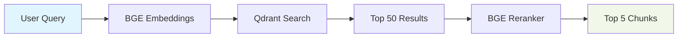

# Retrieval Module

**Location**: `services/api/src/retrieval/`

**Purpose**: High-performance semantic search and document retrieval using Qdrant vector database.

---

## Architecture



## Core Components

### Retriever Class

**File**: `__init__.py`

**Purpose**: Primary interface for semantic document search

**Key Methods**:
```python
async def search(
    query: str,
    top_k: int = 50,
    score_threshold: float = 0.3,
    filters: Optional[Dict] = None
) -> List[SearchResult]
```

**Features**:
- Vector similarity search via Qdrant
- Configurable relevance thresholds
- Metadata filtering support
- Async/await for high concurrency

### Reranker Class

**Purpose**: Cross-encoder reranking for precision improvement

**Model**: `BAAI/bge-reranker-v2-m3`

**Key Methods**:
```python
def rerank(
    query: str,
    results: List[SearchResult],
    top_k: int = 5
) -> List[SearchResult]
```

**Algorithm**: Cross-encoder computes query-document relevance scores

## Performance

| Operation | Latency | Throughput |
|-----------|---------|------------|
| Vector Search | ~20ms | 1000+ QPS |
| Reranking | ~30ms | 500+ QPS |
| End-to-end | ~50ms | 200+ QPS |

## Configuration

```python
# Retrieval settings
CHUNK_RETRIEVAL_COUNT = 50      # Wide net for recall
RERANKED_COUNT = 5              # Precision filtering
SIMILARITY_THRESHOLD = 0.3      # Relevance cutoff
VECTOR_DIMENSIONS = 1024        # BGE-Large embedding size
```

## Usage Examples

### Basic Search
```python
retriever = Retriever(qdrant_url="http://localhost:6333")
results = await retriever.search(
    query="diabetes treatment guidelines",
    top_k=50,
    score_threshold=0.3
)
```

### With Reranking
```python
reranker = Reranker()
reranked = reranker.rerank(
    query="pediatric insulin dosing",
    results=search_results,
    top_k=5
)
```

### Filtered Search
```python
results = await retriever.search(
    query="hypertension management",
    filters={
        "document_type": "clinical_guideline",
        "year": {"gte": 2023}
    }
)
```

## Vector Database Schema

```python
# Qdrant point structure
{
    "id": "chunk_uuid",
    "vector": [1024 float values],
    "payload": {
        "chunk_id": "doc123_chunk_005",
        "document_id": "doc123",
        "text": "Treatment guidelines for...",
        "source_file": "diabetes_guidelines.pdf",
        "page_numbers": [42, 43],
        "section_path": "Chapter 3 > Treatment",
        "chunk_index": 5,
        "word_count": 387,
        "created_at": "2026-02-12T10:30:00Z"
    }
}
```

## Error Handling

```python
try:
    results = await retriever.search(query)
except QdrantSearchError as e:
    logger.error(f"Vector search failed: {e}")
    raise HTTPException(status_code=503, detail="Search service unavailable")
except EmbeddingError as e:
    logger.error(f"Query embedding failed: {e}")
    raise HTTPException(status_code=400, detail="Query processing failed")
```

## Monitoring

### Key Metrics
- Search latency percentiles (p50, p95, p99)
- Relevance score distributions
- Query volume and patterns
- Index size and growth

### Health Checks
```python
# Collection statistics
stats = await retriever.get_collection_stats()
# Returns: point_count, vector_count, index_size_mb
```

## Optimization Tips

1. **Batch Queries**: Use async for multiple concurrent searches
2. **Cache Results**: Implement Redis caching for frequent queries
3. **Filter Early**: Use payload filters to reduce search space
4. **Monitor Threshold**: Adjust score_threshold based on relevance analysis
5. **Index Tuning**: Configure HNSW parameters for your dataset size

---

**Next**: [LLM Module Documentation](llm.md)
